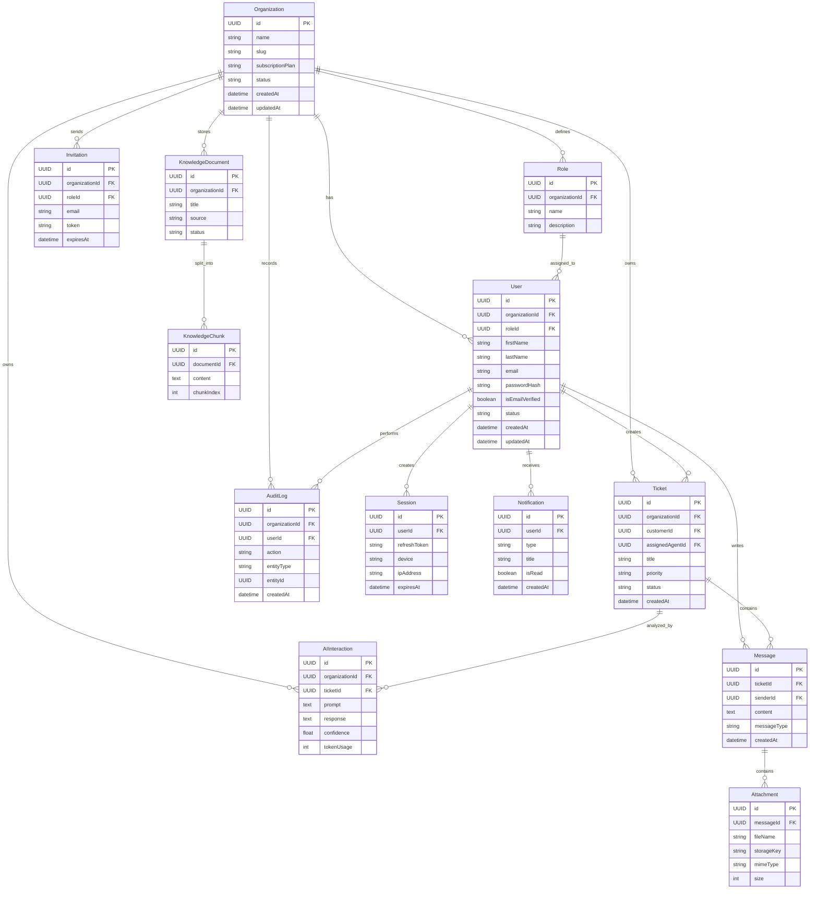

# Entity Relationship Diagram (ERD)

## Overview

This document provides the Entity Relationship Diagram (ERD) for the SupportOS database. The diagram visualizes the relationships between all major entities and serves as a reference for database implementation using Prisma ORM and PostgreSQL.

---

# Entity Relationship Diagram

---

# Relationship Summary

| Parent Entity | Child Entity | Relationship |
|---------------|--------------|--------------|
| Organization | User | One-to-Many |
| Organization | Role | One-to-Many |
| Organization | Ticket | One-to-Many |
| Organization | Invitation | One-to-Many |
| Organization | KnowledgeDocument | One-to-Many |
| Organization | AuditLog | One-to-Many |
| Organization | AIInteraction | One-to-Many |
| Role | User | One-to-Many |
| User | Session | One-to-Many |
| User | Ticket | One-to-Many |
| User | Message | One-to-Many |
| User | Notification | One-to-Many |
| User | AuditLog | One-to-Many |
| Ticket | Message | One-to-Many |
| Ticket | AIInteraction | One-to-Many |
| Message | Attachment | One-to-Many |
| KnowledgeDocument | KnowledgeChunk | One-to-Many |

---

# Design Principles

The ERD follows these principles:

- UUID primary keys for all entities.
- Foreign key constraints ensure referential integrity.
- Organization is the root entity for tenant isolation.
- Business entities are normalized to reduce redundancy.
- Soft deletes are preferred for critical business data.
- Audit logging provides traceability across the system.

---

# Notes

- Every tenant-specific entity references an `organizationId`.
- All timestamps should use UTC.
- Relationships shown here map directly to Prisma `@relation` definitions.
- Future entities (Teams, Permissions, Workflows, Integrations) can be added without redesigning the existing schema.

---

# Summary

This Entity Relationship Diagram provides the structural foundation of the SupportOS database. It documents entity ownership, relationships, and key attributes, ensuring consistency between the architecture documentation and the future Prisma schema implementation.